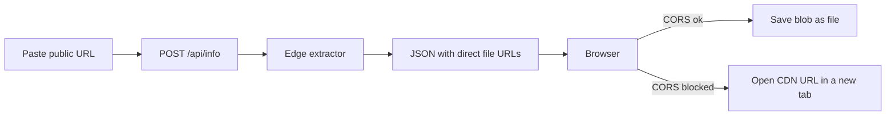

# Direct browser downloads for all 12 platforms

Public posts only. Direct files only (MP4, WebM, MOV, MP3, JPG/PNG/WebP/GIF). HLS-only videos get a clear error. No cookies, no login bypass, no video bytes through Cloudflare.

## How it works today

[`/api/info`](src/app/api/info/route.js) already calls the 12 extractors. Each file’s `downloadUrl` is built in [`createMediaResponse`](src/services/base.js) as `/api/download?url=...`, and [`GET /api/download`](src/app/api/download/route.js) fetches that URL and streams the body. The Download button in [`DownloadResult.jsx`](src/components/download/DownloadResult.jsx) opens that proxy, so every video passes through the Worker. [`POST /api/download`](src/app/api/download/route.js) also treats the page link as the file.

## Backend stays light

- Keep extraction on the edge. It only fetches HTML or JSON and returns a small list of file URLs.
- In [`src/services/base.js`](src/services/base.js), drop playlist URLs (`.m3u8`, `.mpd`, `format: hls`). `downloadUrl` becomes the direct file URL, same as `url`. If nothing direct remains, throw: “This video is only available as a stream, not a downloadable file.”
- Remove the HLS “auto” entry in [`dailymotion.service.js`](src/services/dailymotion.service.js) and skip `V_HLSV4` in [`pinterest.service.js`](src/services/pinterest.service.js).
- [`POST /api/download`](src/app/api/download/route.js) stops returning the page URL as `downloadUrl`. It records the attempt and points the client at the files from `/api/info`.
- [`GET /api/download`](src/app/api/download/route.js) stops streaming. It returns **302** to the direct file only when the host is on an allowlist (fbcdn, cdninstagram, tiktokcdn, tikwm, twimg, snap/sc-cdn, jtvnw/ttvnw, dmcdn, vimeocdn, redd.it/redditmedia, pinimg, licdn, and the platform sites). Any other host is rejected. That closes the open proxy and keeps video bandwidth off Cloudflare.
- Reddit stays two files when the platform splits them: video MP4 and a separate audio file. No server-side merge.

## Browser does the save

- [`useDownload.js`](src/hooks/useDownload.js): download the direct URL with `fetch`. If the CDN allows it, read the body (real progress from `Content-Length`) and save a blob with the right extension. If CORS blocks the fetch, open the direct CDN URL in a new tab and show: the file is served by the platform, not by SaveFromPro. Use the browser save control if it plays instead of downloading.
- [`DownloadResult.jsx`](src/components/download/DownloadResult.jsx): the Download control calls that helper. It no longer uses an `<a href="/api/download">` that pulls the file through the Worker. Copy Link still copies the direct file URL.

## Tests

- Update [`tests/download.test.js`](tests/download.test.js) so mocked extractors expect a direct `http` file URL, a real extension (`mp4`/`webm`/`mp3`/`jpg`), and no `.m3u8`. `GET /api/download` expects 302 for an allowlisted host and 400 for anything else.
- Add [`tests/live-download.test.js`](tests/live-download.test.js), run with `npm run test:live` (`LIVE_DOWNLOAD=1`). For each platform, call the real extractor against a known **public** URL, then request the first bytes of each file and assert `Content-Type` is video, audio, or image — not HTML. Platforms that refuse anonymous access must throw the public-post error, not return the page URL or a fake file.
- `npm test` stays offline and mocked so normal runs do not depend on those sites.

## What will not download

- Private, friends-only, login-walled, deleted, or region-locked posts.
- Videos that only exist as HLS/DASH playlists.
- A single merged Reddit file (video and audio stay separate when Reddit splits them).
- A guaranteed Save dialog when the CDN blocks browser `fetch`. In that case the browser opens the file from the CDN and Cloudflare still sends no video bytes.
